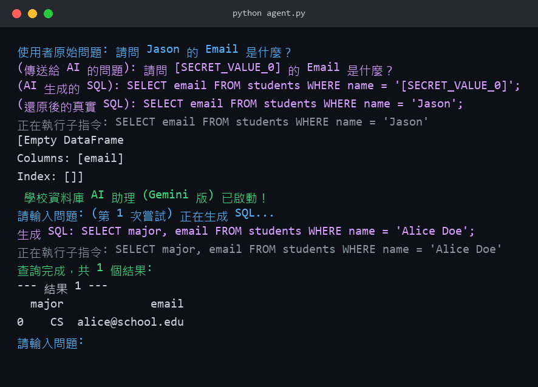

Smart Text-to-SQL Agent with Self-Correction & Security
    這是一個具備 自我修正能力 (Self-Correction) 與 多層資安防護 (Multi-Layer Security) 的智慧型 SQL 生成代理人 (Agent)。

它不僅能將自然語言轉換為 SQL，還能像資深工程師一樣讀取錯誤訊息並自動 Debug，同時透過「中間件模式」的 Data Vault 實現使用者輸入的 PII 去識別化，避免敏感資料明文傳給外部 LLM。

核心功能 (Key Features)
1. 智慧生成與自我修正 (Agentic Workflow)
動態 Schema Linking：自動讀取資料庫結構，無需手動定義，適應欄位變更。

自動除錯迴圈 (Self-Correction Loop)：當生成的 SQL 執行失敗時，Agent 會捕捉錯誤訊息 (Error Message)，並將其回饋給 LLM 進行重寫，直到成功為止。

2. 資安架構 (Data Vault Middleware)
PII 去識別化 (Data Vault)：使用者輸入中，符合預先定義敏感名單（目前為 DataVault.py 中的固定清單，如人名、電話）的內容，在傳送給 AI 前會被替換為 Token (e.g., [SECRET_VALUE_0])；SQL 生成後，執行前再自動還原為原始值。

> 目前為示範用的靜態名單比對 (非 NER 模型)，敏感欄位/Schema 雜湊化尚未實作，屬未來規劃項目 (見下方「未來規劃」)。

3. 混合執行引擎 (Hybrid Executor)
智慧區分 Read (SELECT) 與 Write (INSERT/UPDATE) 操作。

查詢操作回傳 Pandas DataFrame 以利分析。

寫入操作自動執行 Transaction Commit。

系統架構 (Architecture)
程式碼片段
graph TD
    User[User Input] --> Vault[Data Vault PII Masking]
    Vault --> LLM[Google Gemini Model]
    LLM -- Generated SQL with Token --> Vault
    Vault -- Desanitized SQL --> Executor[SQL Executor]
    Executor -- Result/Error --> Logic{Success?}
    Logic -- Yes --> User
    Logic -- No Error Msg --> LLM

示範畫面 (Demo)

快速開始 (Quick Start)
1. 環境設定
確保已安裝 Python 3.8+，並安裝所需套件：

Bash
pip install -r requirements.txt
2. 設定 API Key
在專案根目錄建立 .env 檔案，並填入你的 Google Gemini API Key：

程式碼片段
GEMINI_API_KEY=你的_API_KEY_填在這裡

> 注意：請勿將 .env 或任何真實 API Key 提交至版本控制。
3. 初始化資料庫
執行以下指令建立測試用的學校資料庫 (school.db)：

Bash
python setup_school_db.py
4. 啟動 Agent
執行主程式開始對話：

Bash
python agent.py

使用範例 (Usage Examples)
場景 1：複雜查詢 (Complex Query)
User: "列出 Alice Doe 修了哪些課程以及她的成績？"

Agent: 自動執行 JOIN students, enrollments, courses 並回傳表格。

場景 2：資料寫入 (Data Insertion)
User: "新增學生資料 : Stanley ABCB1111@nptu.edu.tw 2001 CS"

Agent: 識別為 INSERT 指令，執行寫入並 Commit，回傳受影響行數。

場景 3：自我修正 (Self-Correction)
User: "找出所有學生的 student_name" (故意講錯欄位)

Agent:

嘗試執行 SELECT student_name ... 失敗 (no such column)。

收到錯誤，分析 Schema。

自動修正為 SELECT name ... 成功。

場景 4：資安防護 (Privacy Protection)
User: "幫我查 Jason 的成績"

Log:

傳給 AI 的 Prompt: "幫我查 [SECRET_VALUE_0] 的成績" (Jason 被隱藏)

AI 生成 SQL: SELECT ... WHERE name = '[SECRET_VALUE_0]'

執行前還原: SELECT ... WHERE name = 'Jason'

專案結構 (File Structure)
Plaintext
.
├── agent.py              # 核心程式：Agent 邏輯 (生成/執行/自我修正)
├── DataVault.py          # 資安中間件：PII 去識別化/還原 (Data Vault)
├── setup_school_db.py    # 工具程式：建立模擬用的 SQLite 資料庫
├── Test_API.py           # 工具程式：列出目前 API Key 可用的 Gemini 模型
├── requirements.txt      # Python 套件相依清單
├── .gitignore            # 排除 __pycache__ / .env / school.db
├── school.db             # 資料庫檔案 (由 setup 產生，已加入 .gitignore)
├── .env                  # 環境變數 (API Key，需自行建立，勿提交至版控)
└── README.md             # 專案說明文件

技術筆記 (Technical Notes)
本專案展示了以下進階軟體工程概念：

Prompt Engineering: Few-Shot Learning 與 Chain-of-Thought (CoT) 的應用。

Middleware Pattern: 實作 DataVault 作為 PII 去識別化中間件。

Dependency Injection: 將 LLM 模型與資料庫連線解耦。

Error Handling: 針對 NoneType iterable 與 Pandas ambiguous truth value 的處理。

未來規劃 (Roadmap)
目前 DataVault 的敏感名單為程式內寫死的固定清單，尚未支援：

動態 PII 偵測 (e.g. NER 模型或正則規則庫)，取代手動列舉名單。

Schema 混淆：將敏感欄位名稱雜湊化後才傳給 LLM，避免真實資料庫結構外洩。

SQL 安全檢查 (Read-Only 白名單、危險語法阻擋) 於執行前強制檢查。

免責聲明 (Disclaimer)
本專案僅供學術研究與教育用途。在生產環境中使用 LLM 生成 SQL 仍存在風險，請務必搭配嚴格的權限控管 (Read-Only User) 與人工審核機制。